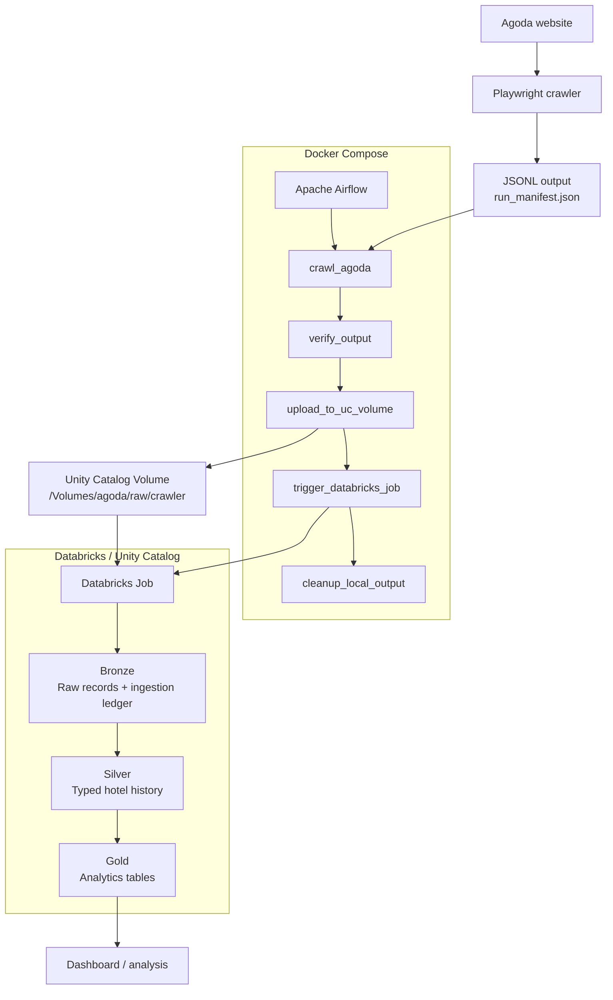

# Agoda hotel data pipeline

Pipeline thu thập khách sạn Agoda bằng Playwright, điều phối bằng Airflow và
xử lý dữ liệu trên Databricks Unity Catalog.

```text
Airflow crawl
  -> verify JSONL + manifest
  -> upload UC Volume
  -> trigger Databricks Job
  -> Bronze -> Silver -> Gold
```

## Project flow



Each Airflow run creates a manifest that identifies its JSONL files. Airflow passes
the uploaded `manifest_path` to Databricks, so Bronze, Silver, and Gold process the
same batch deterministically.

## 1. Điều kiện cần

- Docker Desktop chạy Linux containers.
- Databricks workspace có Unity Catalog Volume:
  `/Volumes/agoda/raw/crawler`.
- Một Databricks Job gồm ba notebook tasks: Bronze, Silver và Gold.
- Token Databricks có API scopes `files` và `jobs`; token owner có quyền
  `Can Manage Run` trên Job.

## 2. Cấu hình root `.env`

Tạo hoặc cập nhật file `.env` tại root dự án. Không commit file này.

```dotenv
# Crawler
AGODA_DESTINATIONS=Vung Tau,Da Nang,Nha Trang,Ho Chi Minh
AGODA_MAX_PAGES=5
AGODA_HEADLESS=true

# Airflow
AIRFLOW_UID=50000
_AIRFLOW_WWW_USER_USERNAME=<airflow-user>
_AIRFLOW_WWW_USER_PASSWORD=<airflow-password>
AIRFLOW__CORE__FERNET_KEY=<fernet-key>
AIRFLOW__API_AUTH__JWT_SECRET=<jwt-secret>
AGODA_AIRFLOW_SCHEDULE="15 4 * * *"
AGODA_AIRFLOW_TIMEZONE=Asia/Ho_Chi_Minh
AGODA_CHECK_IN_OFFSET_DAYS=21
AGODA_AIRFLOW_OUTPUT_DIR=data/airflow
AGODA_LOCAL_RETENTION_DAYS=14

# Databricks
DATABRICKS_HOST=https://<workspace-host>
DATABRICKS_TOKEN=<token-with-files-and-jobs-scopes>
DATABRICKS_UC_VOLUME_PATH=/Volumes/agoda/raw/crawler
DATABRICKS_JOB_ID=<job-id>
DATABRICKS_JOB_TIMEOUT_SECONDS=3600
```

DAG chạy lúc **04:15** mỗi ngày theo `Asia/Ho_Chi_Minh`. Mỗi scheduled run
crawl một ngày check-in bằng cuối Airflow data interval cộng 21 ngày; check-out
tự động là ngày kế tiếp.

## 3. Setup Databricks một lần

### Upload source

Upload toàn bộ thư mục `databricks/` vào Workspace, ví dụ:

```text
/Workspace/Users/<your-email>/databricks
```

Không upload `__pycache__/` hoặc file `.pyc`.

### Tạo Unity Catalog tables

Chạy notebook sau một lần:

```text
/Workspace/Users/<your-email>/databricks/notebooks/setup_uc_objects_wrapper
```

Với parameter:

```text
project_root=/Workspace/Users/<your-email>/databricks
```

Kết quả mong đợi:

```text
{'status': 'success', 'tables_ready': 7}
```

### Cấu hình Databricks Job

Tạo ba notebook tasks theo thứ tự:

```text
ingest_bronze_wrapper -> transform_silver_wrapper -> build_gold_wrapper
```

Mỗi task dùng Workspace notebook tương ứng trong `databricks/notebooks/`, và
có base parameters:

```text
project_root=/Workspace/Users/<your-email>/databricks
manifest_path={{job.parameters.manifest_path}}
```

Ở cấp **Job parameters**, tạo:

```text
manifest_path=__AIRFLOW_SUPPLIES_MANIFEST_PATH__
```

Airflow sẽ override `manifest_path` cho từng Job run. `agoda_etl/` là Python
package chứa logic; ba notebook chỉ nhận widgets rồi import và gọi package.

Chi tiết hơn xem [Databricks README](databricks/README.md).

## 4. Khởi động Airflow

Từ root dự án:

```powershell
docker compose -f airflow/docker-compose.yml build
docker compose -f airflow/docker-compose.yml up airflow-init
docker compose -f airflow/docker-compose.yml up -d
```

`airflow-init` có trạng thái `Exited (0)` là bình thường: đây là container khởi
tạo chạy một lần. Kiểm tra các service chính:

```powershell
docker compose -f airflow/docker-compose.yml ps
```

Mở <http://localhost:8080>, đăng nhập bằng `_AIRFLOW_WWW_USER_USERNAME` và
`_AIRFLOW_WWW_USER_PASSWORD` trong `.env`.

## 5. Chạy pipeline từ đầu đến cuối

1. Trong Airflow UI, mở DAG `agoda_daily_crawl` và bỏ pause.
2. Chọn **Trigger DAG** để tạo một DAG run mới.
3. Theo dõi các task:

   ```text
   crawl_agoda
     -> verify_output
     -> upload_to_uc_volume
     -> trigger_databricks_job
     -> cleanup_local_output
   ```

`trigger_databricks_job` lấy remote manifest path từ `upload_receipt.json` của
đúng crawler attempt, sau đó gọi Databricks Jobs API với:

```text
manifest_path=/Volumes/agoda/raw/crawler/.../run_manifest.json
```

Task chờ Job hoàn tất. Nếu Databricks Bronze, Silver hoặc Gold fail thì task
Airflow này fail và `cleanup_local_output` không chạy.

Để test với check-in date của Airflow interval hiện tại, nhập khi trigger:

```json
{"check_in_offset_days": 0}
```

Luôn tạo **DAG run mới** để chạy lại pipeline end-to-end. Clear/retry task
`trigger_databricks_job` của một run đã fail sẽ nhận lại Databricks run cũ do
idempotency token.

## 6. Kiểm tra kết quả

### Local Airflow output

```text
data/airflow/dag_id=<dag-id>/batch_id=<batch-id>/attempt=<n>/
  agoda_hotels_YYYY-MM-DD.jsonl
  run_manifest.json
  upload_receipt.json
```

JSONL chỉ chứa business fields của khách sạn. `run_manifest.json` là nguồn duy
nhất của `batch_id`, `airflow_run_id` và các metadata Airflow. `upload_receipt`
là biên lai local xác nhận các file đã được upload lên Volume.

### Unity Catalog Volume

```text
/Volumes/agoda/raw/crawler/
  dag_id=<dag-id>/
    batch_id=<batch-id>/
      attempt=<n>/
        agoda_hotels_YYYY-MM-DD.jsonl
        run_manifest.json
```

### Unity Catalog tables

Sau Job thành công, kiểm tra:

```text
agoda.raw.agoda_hotels_bronze
agoda.raw.agoda_ingestion_ledger
agoda.silver.agoda_hotels_history
agoda.gold.agoda_hotel_daily_summary
agoda.gold.agoda_destination_daily_summary
agoda.gold.agoda_rating_distribution
agoda.gold.agoda_price_by_star
```

Bronze và Silver idempotent theo `record_id`. Gold rebuild từ toàn bộ Silver
history để bảng tổng hợp luôn gồm cả dữ liệu cũ và batch mới.

## 7. Khi thay đổi code hoặc cấu hình

- Thay đổi crawler, Airflow scripts, `requirements.txt` hoặc Dockerfile:

  ```powershell
  docker compose -f airflow/docker-compose.yml build
  docker compose -f airflow/docker-compose.yml up -d --force-recreate
  ```

- Thay đổi `.env`: recreate Airflow services để nạp biến mới.
- Thay đổi `databricks/agoda_etl/` hoặc notebook: upload lại source lên cùng
  Workspace folder; sau đó chạy Job trực tiếp với một manifest có sẵn hoặc tạo
  DAG run Airflow mới.

## 8. Chạy crawler thủ công (tùy chọn)

Để debug ngoài Airflow, cần truyền run identity rõ ràng:

```powershell
python main.py --airflow-dag-id adhoc --airflow-run-id manual_001 `
  --airflow-try-number 1 --output-dir data/airflow `
  --destinations "Vung Tau" --date 2026-08-15 --max-pages 1 `
  --workers 1 --no-enrich-details
```

Lệnh này chỉ crawl local; không tự upload hay trigger Databricks.

## Tài liệu chi tiết

- [Airflow runbook](airflow/README.md)
- [Databricks ETL](databricks/README.md)
- [Manifest và ingestion contract](docs/DATABRICKS_INGESTION.md)
